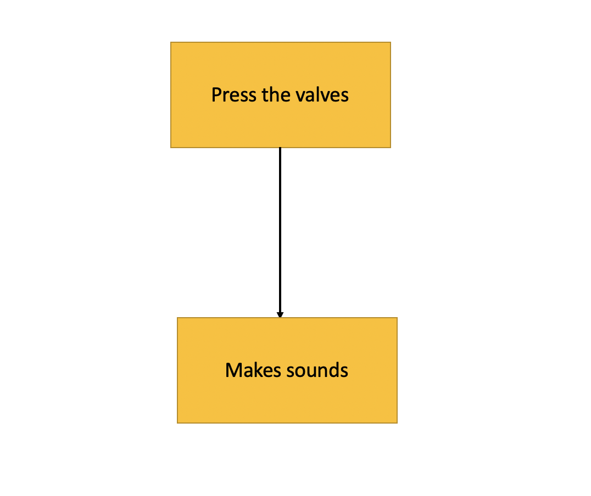

# Assessment 1: Replication project

*Markdown reference:* [https://guides.github.com/features/mastering-markdown/](http://guides.github.com/features/mastering-markdown/)

## Replication project choice ##

Guitar

### Related project 1 ###

Banana Keyboard

https://makecode.microbit.org/projects/banana-keyboard

This project is related to mine because it had similar ideas to mine. It also involved holding down buttons to make sounds, and it is also a musical instrument project. 

### Related project 2 ###

Hack Your Headphones

https://makecode.microbit.org/projects/hack-your-headphones

This project is related to mine because this project involved headphones and music, just like this project did as well. 

### Related project 3 ###

Milk Carton Robot

https://makecode.microbit.org/projects/milk-carton-robot

This project is related to mine because it is also taking some cardboard, and using art, making a fun toy/interactive machine out of it. 

### Related project 4 ###

Reaction Time

https://makecode.microbit.org/projects/reaction-time

This project is related to mine because it is also involving a reaction to you pressing against the actual project. 

### Related project 5 ###

Rock Paper Scissors

https://makecode.microbit.org/projects/rock-paper-scissors

This project is related to mine because this is interactive as well and it also reacts to how the user uses the project.

### Related project 6 ###

Magic Button Trick

https://makecode.microbit.org/projects/magic-button-trick

This project is related to mine because you have to press a button to make the rabbit appear out of the hat. Mine had a similar approach, whcih was that if you pressed the buttons, it would play different sounds.

### Reading: Don Norman, The Design of Everyday Things, Chapter 1 (The Psychopathology of Everyday Things) ###

*What I thought before: I didn't know what this reading would be about. I couldn't think of what it would be about at all.*

*What I learned: This reading made me realise that we don't think about how doors are really design. Sure, we get annoyed when we push a pull door, but we don't actually think about why doors were designed like that.*

*What I would like to know more about: Why would people think it was an idea to design anything so confusing?.*

*How this relates to the project I am working on: This relates to my project because they are both considered 'interactive' and I like how both the reading and my project are respnding to how people react to them.*

### Reading: Chapter 1 of Dan Saffer, Microinteractions: Designing with Details, Chapter 1 ###

*What I thought before: I thought that this reading was going to focus on a specific micro-interactive machine, such as a mini-robot for example. 

*What I learned: I learned what a micro-interaction was, and how many things are actually micro-interactive.*

*What I would like to know more about: Are there many more micro-interactions out there that we don't know about?*

*How this relates to the project I am working on: This relates to my project because a micro-interaction are contained product moments that revolve around a single use case—they have one main task. My project has one main task too - press the buttons and sound will come out.*

### Reading: Scott Sullivan, Prototyping Interactive Objects ###

*What I thought before: I thought this reading was going to be about many different interactive objects there are in the world.*

*What I learned: I learned that there are many things that are still yet to be designed. It may seem like a lot of techologies and interactive objects have been designed already, but it's only just the beginning, and who knows what technologies they'll have in the future.*

*What I would like to know more about: Does anybody have an idea as to what sort of interactive technologies would be developed in the future?*

*How this relates to the project I am working on: This relates to my project because both the reading and my project relate to interactive projects.*

## Interaction flowchart ##

## Process documentation ##

*Materials: Microbit, headphones, 4 bobby pins, cardboard, trumpet paper template, acrylic paint, tape, battery pack.*

Paper template used for the cardboard. 

Final product completed. 

https://makecode.microbit.org/projects/guitar
Reference for the project. 

### Project title ###
Electronic Trumpet

### Project description ###

*The project is a cardboard trumpet, but everytime you press the three valves (the buttons on top of it), then sound comes out of them. It is mainly made for children, as it helps to teach them all about music, technology and coding, all in a fun way. It is used by pressing the valves, so it is easy for children and anybody to use.*

### Showcase image ###

*Try to capture the image as if it were in a portfolio, sales material, or project proposal. The project isn't likely to be something that finished, but practice making images that capture the project in that style.*

### Additional view ###

*Below is a link to an YouTube video that demonstrates the use of the electronic trumpet.*

https://www.youtube.com/watch?v=vPoIxL7TKsg 

### Reflection ###

*The parts of the project that I felt were the most successful were the design (as it tuend out better than I thought it would) and the coding wasn't completely successful (I wanted to try to change the sound by also picking up the trumpet, but that didn't work). So the coding was both successful, and could use improvement too.*

*I learned that cutting cardboard is really hard, and painful, but it turned out great at the end, so it was worth it. Also, it brought out my musical and creative sides, which I appreciated. I had to look up instructions from the original guitar microbit project, and I also had to look up definitions, images, tutorials and other projects for references, so I learned many things that I could apply to my project.*

*I had to re-read the readings mentioned earlier to answer those questions, so that was a good refresher as it was a while since I last read them. (Sullivan, 2014), (Saffer, 2014), (Normam, 1988). I thought of the trumpet myself, as that is very personal to me. Other things were mainly based on the guitar project, I just had to adapt them to a trumpet instead.*

*An imteresting extension on this project might be that I could have added an option where if you pressed one of the valves, or one of the microbit buttons, a song would play through the trumpet and you would have to repeat that by pressing the valves. Therefore, it turns it into a fun game, and it helps you to remember more songs faster, especially if you have a younger brain.*
